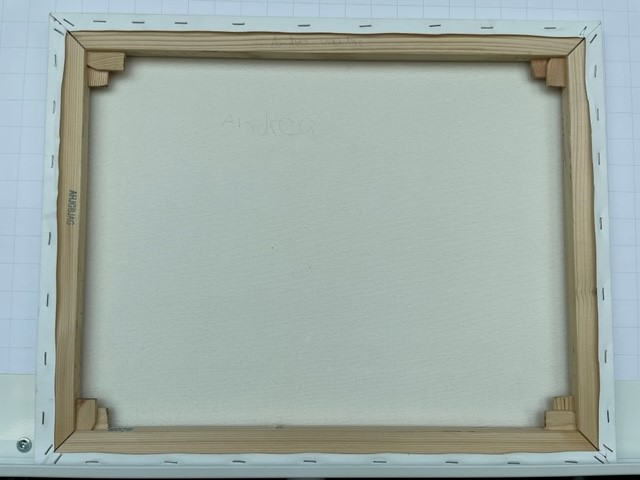
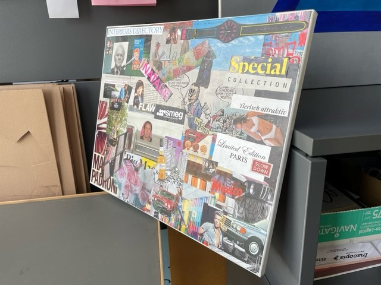
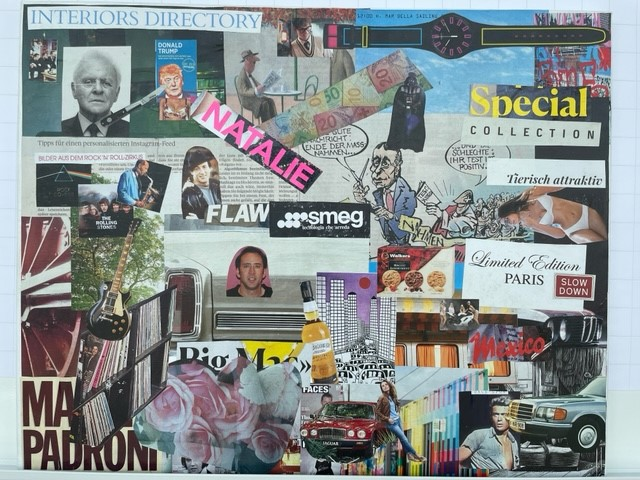

+++
title = "Individuelle Collage"
date = "2022-05-16"
draft = false
pinned = true
tags = ["Collage"]
image = "collage.jpg"
description = "Sie suchen ein neues Bild, welches ihr Zimmer beschmückt? Dann sind Sie hier richtig!\nIm Folgenden finden Sie eine Anleitung, wie Sie eine super coole Collage kreieren können."
footnotes = "Andrea Spörri"
+++
Sie haben sich entschieden eine Collage zu kreieren. Zuerst müssen Sie entscheiden, wie gross die Leinwand überhaupt sein soll. Ich persönlich empfehle eine maximale Grösse von einem A3-Blatt. Schliesslich geht es ums Ausschneiden von Bildern und je grösser die Leinwand, desto mehr Aufwand muss mit der Schere in das Projekt gesteckt werden. 

Als nächstes müssen Sie sich überlegen, welche Themen in eurer Collage abgebildet werden sollen. Sie können sich für Musik, Autos, Personen, Tiere usw. entscheiden. Sie können auch mehrere verschiedene Themen runterbringen. Die Bilder können auch von persönlicher Bedeutung sein. Das macht die Collage spannender und personalisierter. 

Wenn Sie alles beisammen haben, beginnt die eher mühsamere Arbeit. Sie durchblättern alle möglichen Zeitschriften und suchen passende Bilder aus, welche Sie sorgfältig ausschneiden und sammeln. Diese Bilder ordnen Sie auf der Leinwand wie Sie es wünschen an. 

Für den Klebestoff empfehle ich Kleister. Damit die Bilder auch schön kleben ist es wichtig, dass Sie die Rückseite auch bekleben. 

Wenn euer Meisterwerk getrocknet ist, können Sie Bilder, die noch ein bisschen abstehen , noch einmal nachkleben.

Fertig ist das einfache Kunstwerk;)

